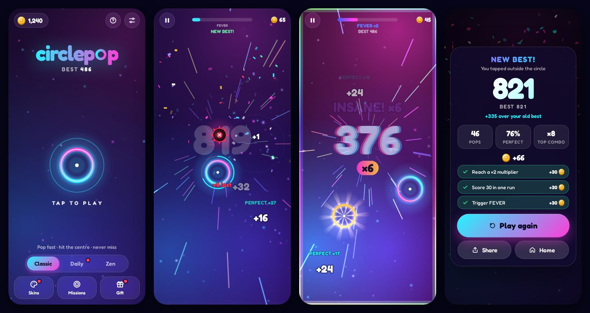

# CirclePop — 2026 edition



**Pop the circle. Chase the perfect streak. Hit FEVER.**

The 2020 original was one blue ring on a white screen: tap it before the red bar runs out, miss and you're done. The 2026 edition keeps that one-tap core and builds a lot more game around it.

## What's in it

| | |
|---|---|
| **Perfect hits** | Hit the centre for a PERFECT. Every perfect in a row climbs a musical scale, so a streak plays a melody. Every third one bumps the multiplier, up to **×8**. |
| **FEVER** | Perfects fill the FEVER meter. When it's full you get warp-speed visuals, the music drops, two circles at once, double points, and no penalty for misses. |
| **Threats and treats** | Bombs you must not touch, gold circles (5× points and coins), moving circles, and power-ups: 🛡 Shield, ⏳ Slow-mo, ✖2 Double. Each is introduced gradually with a one-time tip. |
| **Juice** | Particles, shockwaves, screen shake, hit flashes, slow-mo on death, confetti on a new best, haptics (native iOS/Android, plus the iOS 18 Safari switch trick). |
| **Adaptive music** | A generative synth-pop track that reacts to play: calm on the menu, drums when you start, hats and arps on a hot streak, everything during FEVER. Pop notes are tuned to the current chord. |
| **11 skins** | Neon, OG (the original 2020 look with its original sounds), Bubbles, Sunset (synthwave grid), Toxic, Arcade (pixels and scanlines), Candy, Cosmic, Midas, Prism and Mono. Each has its own instrument. |
| **Modes** | **Classic**; **Daily Challenge**, where everyone gets the same seeded circles with a daily twist (Gold Rush, Minefield, Hyper, Drift…) and a streak; **Zen**, with no timer and no game over. |
| **Progression** | Coins, a skin shop with live preview, 3 rotating missions that get harder over time, a daily gift with a streak, lifetime stats, and a one-time-per-run *Second chance* revive. |
| **Shareable** | A share card (1080×1350) plus Wordle-style text: `🟣🟣🔵🟡🟣…💥`, sent through the native share sheet. |
| **"So close!"** | The results screen tells you exactly how many points you missed your best by. |

## Play / develop

```bash
npm install
npm run dev        # http://localhost:5173 — open on your phone via the LAN URL
npm test           # unit tests (gameplay, economy, save migration, daily seeds)
npm run build      # production build in dist/ (PWA, works offline)
```

Add `?debug` to the URL to expose `window.__cp()` for poking at the game state.

## Ship it to the App Store / Google Play

The game is a [Capacitor 8](https://capacitorjs.com) app (`capacitor.config.ts`, bundle id `com.ciphervision.circlepop`). On a Mac with Xcode:

```bash
npm run build
npx cap add ios                 # once (and/or: npx cap add android)
npx @capacitor/assets generate --iconBackgroundColor '#150b3e' --splashBackgroundColor '#07061a'
npx cap sync
npx cap open ios                # Xcode: pick your team → Product → Archive → upload
```

`resources/icon.png` (1024², no transparency) and `resources/splash.png` (2732²) are the sources for every native icon and splash size.

Before submitting:

- In Xcode, set **Device Orientation** to *Portrait* only and **Status Bar** to hidden. The app also hides it at runtime.
- Put your store links in `src/config.ts` (`APP_STORE_URL` / `PLAY_STORE_URL`) so shared scores link back to the game.
- App Privacy: the game has no accounts, ads, analytics, or tracking. Progress lives on the device (localStorage mirrored to `@capacitor/preferences`), so the answer is **Data Not Collected**. Age rating: 4+.
- Screenshots: `npm run dev`, open it in a 6.9" / 6.5" / iPad simulator, and capture the home screen, FEVER, results and the skins shop.

Web build: `dist/` is fully static, so it can go on any host. To publish on GitHub Pages, set *Settings → Pages → Source* to "GitHub Actions" and run the **Deploy web build to GitHub Pages** workflow.

## Tuning

All difficulty knobs are in `src/game/difficulty.ts`: time per circle, circle size, bomb and gold rates, moving speed, FEVER length, and multiplier steps. Economy (coins per run, mission rewards, gift, revive cost) is in `src/meta/missions.ts`. Skin prices and palettes are in `src/meta/skins.ts`.

## Project layout

```
src/
  game/      pure, deterministic gameplay simulation (unit tested)
  render/    Canvas 2D renderer: background, targets, particles, HUD, effects
  audio/     Web Audio engine, synthesized SFX voices, generative music
  meta/      save + migration, missions, skins, daily challenge, share card
  platform/  Capacitor + haptics glue (no-ops on the web)
  ui/        DOM overlay screens and styles
  app.ts     the state machine that ties it all together
```

## Credits

- Game and code: CipherVision. MIT license.
- Font: [Fredoka](https://fonts.google.com/specimen/Fredoka), SIL Open Font License. It replaces the commercially licensed Helvetica Rounded used by the 2020 version.
- The pop, buzz and claps samples come from the original CirclePop and are used in the OG skin.
